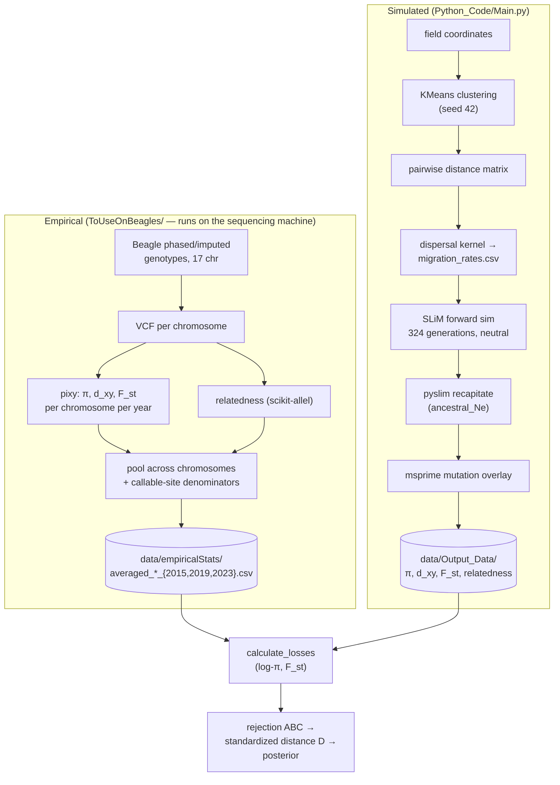

# Spatiotemporal CPB Modeling with SLiM

Inferring the demography and dispersal of the **Colorado Potato Beetle** (*Leptinotarsa
decemlineata*) across the Wisconsin agricultural landscape, by fitting a spatially explicit
forward simulation to sequenced beetle genomes with **Approximate Bayesian Computation**.

<p>
  
  
  
  
  
  
</p>

---

## What this is

CPB is one of the most economically damaging insect pests of potato, and it has repeatedly evolved
resistance to whatever is sprayed on it. How fast resistance alleles move between fields depends on
how much beetles actually mix across a farming landscape — a quantity that is far easier to ask a
genome than to observe in a field.

This project attacks that question from both ends:

- **Empirical.** Sequenced CPB genomes from Wisconsin fields, phased and imputed with Beagle across
  17 chromosomes, sampled in **three years — 2015, 2019, 2023** — with a different set of field
  sites each year (24 / 17 / 20 subpopulations). Per-year π, d_xy, F_st and genetic relatedness
  matrices are computed with `pixy` and `scikit-allel`.
- **Simulated.** A spatially structured, neutral forward simulation in **SLiM**, whose demes are
  KMeans clusters of real field coordinates and whose migration matrix is an exponential dispersal
  kernel over real geographic distances. The forward run records a tree sequence; **pyslim**
  recapitates it, **msprime** overlays mutations, and **tskit** produces the same four statistics
  in the same subpopulation order as the empirical side.

The two sides meet in an **ABC distance** over element-wise log-π and off-diagonal F_st. Rejection
ABC over a large batch of prior draws (run on CHTC / OSPool) gives the posterior over population
size, total immigration rate, and dispersal-kernel scale.

## Pipeline



**Architectural note:** SLiM runs with `initializeMutationRate(0)` — it is a pure neutral tree
sequence recorder. All mutations are overlaid afterwards by msprime, which makes site-level π
exactly linear in μ and makes the mutation rate free with respect to forward-phase memory and
runtime.

## Repository layout

| Path | Contents |
|---|---|
| `Python_Code/Main.py` | Simulation entrypoint: cluster → migration matrix → SLiM → recapitate → statistics |
| `Python_Code/AnalyzeTreeSeq.py` | Recapitation, simplification, mutation overlay, batched tskit statistics |
| `Python_Code/ABCAnalysisNoRedis.py` | ABC driver, priors, `calculate_losses`, IBD helpers. CHTC entrypoint |
| `Python_Code/abc_standardize.py` | Offline MAD-standardization of per-statistic distances → ranked `D` |
| `Python_Code/ld_common.py` | Shared LD-decay binning — imported by **both** the simulated and empirical sides, which run on different machines. Carries a spec hash so the two cannot silently drift apart |
| `Python_Code/GenerateClusterData.py` | KMeans over field coordinates, distance matrix, genome→deme assignment |
| `Python_Code/GenerateSimulationParams.py` | Dispersal kernel → per-deme migration rates |
| `SLiM_Code/CPBSampleSim{Win,Linux}.slim` | The forward simulation (identical apart from path separators) |
| `ToUseOnBeagles/` | Empirical-statistics pipeline — runs on the machine holding the VCFs, not here |
| `diagnostics/` | Sweep harnesses for cost/scaling experiments on an existing tree sequence, plus `collect_batch.py`, which pools a cluster batch and reports what actually drives each distance |
| `data/` | Field data, specifier matrices, empirical targets, simulation outputs |

## Getting started

```bash
conda env create -f environment.yml
conda activate cpb-env

cd Python_Code

# one simulation + statistics (interactive prompts for clusters / kernel scale / POPMULT)
python Main.py

# one ABC job: <job_id> seeds the RNG, results append to ../out/abc_results.csv
python ABCAnalysisNoRedis.py 1 5

# offline, after a batch: freeze σ = 1.4826·MAD per statistic, build the standardized distance
python abc_standardize.py
```

All paths inside `Python_Code/` are relative to that directory, and the pipeline **overwrites files
in `data/` in place** — run experiments on a copy of the tree, not on the repo.

`slim` must be on `PATH` (it ships with the conda environment).

## Cost per trial

Measured on one 15.2 GB machine at `numClusters=33`. Recapitation is ~97% of wall time and is where
essentially all of the memory goes; the forward phase is cheap and linear.

| POPMULT | total N | SLiM time | SLiM peak RSS | analysis time | analysis peak RSS |
|---|---|---|---|---|---|
| 500 | ~1.7k | 4.0 s | 173 MB | ~274 s | 611 MB |
| 5000 | ~17k | 50.9 s | 1.67 GB | 1764 s | 7.63 GB |
| 12000 | ~40k | 169.6 s | 3.94 GB | — OOM at 16 GB — | ≈20 GB (est.) |

Analysis memory is superlinear (exponent ≈1.10) while analysis time is sublinear, projecting
~60 min/trial at the top of the prior. Cluster jobs should be sized for the ceiling, not the
median — rejection ABC pools whatever survives, so undersized memory silently biases the posterior
toward the draws small enough to finish.

## Findings so far

Work to date has been as much about auditing the statistics as running them. The results that
changed the project:

- **π and d_xy were off by ~11.5×.** pixy was run on a variant-sites-only VCF, so its `avg_pi` was
  per-SNP heterozygosity rather than per-site nucleotide diversity. Extending the denominator over
  callable sites moved genome-wide mean π from 0.1403 to **0.0122** — an ordinary insect value.
  F_st, being a ratio of variance components, was never affected, so the structural side of the
  inference was never compromised.
- **pixy's `count_comparisons` overflows int32** at ≥14 diploid individuals, corrupting 244 of
  2015's rows — of which only 18 showed a visible sign flip and the rest were ~18% high and looked
  entirely plausible. Denominators are now computed analytically from sample size, with a
  cross-check that raises rather than warns.
- **Isolation by distance is statistically absent** in all three years (Mantel, 9999 permutations:
  p = 0.64 / 0.15 / 0.99, with the slope sign flipping between years) across sites spanning
  1.7–160 km. The IBD slope was demoted from a fitted statistic to a posterior-predictive check,
  and the dispersal-kernel scale parameter is reported as unidentified rather than inferred.
- **F_st structure is site-coherent, not distance-organized.** Each year's differentiation is
  dominated by a single site (`Mortensen9-2015`, `H41-2023`) that is simultaneously the lowest-π
  and most internally-related sample of its year, and geographically ordinary — the signature of a
  sample of close relatives rather than a distinct population.
- **Population size is identifiable through F_st, not through π.** A POPMULT sweep tracks
  `1/(1+4Nm)` almost exactly and improves the F_st distance 8.7×, even though π depends on N and μ
  only through the confounded product θ = 4Nμ.
- **The two sides were computing different F_st estimators, and it was worth a factor of ~2.**
  tskit's `Fst` implements Nei (1973)/Slatkin (1991), `(d_xy − H_w)/(d_xy + H_w)`, which is about
  *half* of Hudson's `(d_xy − H_w)/d_xy` at low differentiation — while the empirical target came
  from pixy's Weir–Cockerham. On a known-truth two-deme coalescent model, Weir–Cockerham and
  Hudson agree to 1–5% while Nei sits at 0.50× Hudson, so the simulated side had been reporting
  half the statistic it was being fitted against. The gap was 78% of the across-prior range of the
  F_st distance and 47× its run-to-run noise floor, and it biased the inferred population size
  down about twofold. The simulator now computes Hudson from π and d_xy — both already in hand,
  so the fix removes a tree traversal rather than adding one. Both estimators produce ordinary
  small F_st values, which is why this was invisible in the output: *"F_st" names a family, not a
  statistic.*
- **The diversity scale was ~10.8× off, and it was manufacturing a false conflict.** Recalibrating
  μ against the corrected π target (5e-6 → 4.646e-7, measured at three population sizes) dissolved
  a standing blocker: population size and differentiation had appeared to demand incompatible
  values, but with the scale fixed both fitted statistics improve together. Because coalescence in
  the ancestral phase puts a hard ceiling on achievable diversity, the calibration saturates — one
  fixed value covers the entire prior to within ±3%.
- **A ridge sweep over `4·N_e·μ = const`** showed π is invariant along the ridge in both its level
  (±2.6%) and its between-subpop coefficient of variation (<1%), while recapitation cost scales as
  `N_e^2.34`. That combination settled a live question about the ancestral effective size: the
  biologically defensible value would barely change the inference and cannot be simulated in under
  a year of CPU time, so the constant stays where it is and the *language* around μ changes
  instead — it is half of a calibration constant, not a mutation rate, and only θ = 4Nμ is reported.
- **The first full pass identified the dispersal kernel and learned nothing about population
  size.** Rejection ABC over 2,495 trials returned a population-size posterior whose spread is
  82–102% of the prior's at every acceptance threshold, while the kernel-decay parameter — which
  the data cannot legitimately constrain, since isolation by distance is statistically absent —
  collapsed to 5% of its prior width. F_st identifies only the product of size and migration, so
  with both free the two trade off freely: the twenty best trials agree on F_st to a standard
  deviation of 0.000033 while spanning nearly the whole size prior. Conditioning on narrow slices
  of the migration parameters does tighten the estimate, but it also *moves* it 2.5-fold depending
  on where they are pinned — so what the data supports is the product, and any single population
  size is a restatement of the dispersal assumption rather than an inference from genetics.
- **Distance weights are measured, not assumed.** A rank-space variance decomposition across the
  batch showed the diversity distance is majority *nuisance*: 63% of the variance the parameters
  explain in it comes from the mutation-rate draw and only 10% from population size, whereas the
  F_st distance takes essentially none from mutation rate — an empirical confirmation that F_st is
  denominator-invariant. Weighting on replicate noise alone would have given the two statistics
  near-equal weight; weighting on demographic signal gives roughly seven to one.
- **The inherited recombination rate is derived, not measured, and inherits a known error.** The
  source paper estimated the population-scaled rate ρ directly, then divided by its own
  effective-size estimate to report a per-base rate — an estimate that fails the same paper's
  internal consistency check by about fiftyfold. The published value works out to ~275 cM/Mb,
  which is not a possible recombination rate; corrected, it lands at ~2.8 cM/Mb, an ordinary
  insect value. Nothing computed so far depends on it, because neither π nor F_st carries any
  recombination signal — but it is central to the linkage-disequilibrium work now underway.

## Status

**The first inference pass has run, and its result is a negative one: population size is not
identifiable from the current statistics.** 2,495 trials completed cleanly out of 2,500, with
uniform coverage of the population-size prior and no memory failures at the ceiling. The
posterior for population size is nonetheless indistinguishable from the prior — its interquartile
range stays at 82–102% of the prior's at every acceptance threshold down to the strictest 1%.
Meanwhile the dispersal-kernel decay parameter, which the data cannot legitimately constrain,
collapsed to 5% of its prior width.

The mechanism is a textbook confound rather than a bug. F_st depends on the *product* of
population size and migration rate, so with both free the simulation can reproduce the observed
differentiation from anywhere in the prior by trading one against the other. The clearest
demonstration: across the twenty best-fitting trials the F_st distance has a standard deviation of
0.000033 — they are all hitting the same value — while population size ranges over essentially the
whole prior. Nucleotide diversity cannot break the tie, because the simulation's short forward
window means most coalescence happens in a fixed-size ancestral phase that population size never
touches.

Two things the pass did establish. The distance function's weights are now measured rather than
assumed: a variance decomposition across the batch showed that the diversity distance is majority
*mutation-rate nuisance* (63% of its explained variance) rather than demography, so it is
down-weighted roughly seven-fold relative to F_st. And the widened population-size prior is
adequate — the fit no longer presses against its ceiling.

**The current line of work is a linkage-disequilibrium statistic**, which supplies the independent
equation the confound needs: LD decay depends on population size and recombination rate, with
migration absent entirely. Both halves are written and verified against coalescent simulation; the
empirical run that fixes the distance scale is the next step. Its viability turns on where that
decay actually falls, since resolving very short-range LD would be computationally prohibitive.

An unresolved question surfaced while scoping it. The recombination rate the project inherits is
not a measured quantity but a derived one — the source paper obtained it by dividing a measured
population-scaled rate by its own effective-size estimate, and that estimate fails the paper's
internal consistency check by roughly fiftyfold. Corrected, the implied rate is an ordinary insect
value rather than one about 275× too high. Nothing computed so far depends on it, since neither
diversity nor F_st carries recombination signal, but the LD work does.

Design decisions, verified measurements, known defects, and remaining work are tracked in a
separate working log that is not part of this repository.

## References

Cohen, Z. P., et al. (2022). Evidence of hard selective sweeps suggests independent adaptation to
insecticides in Colorado potato beetle (Coleoptera: Chrysomelidae). *Evolutionary Applications*
**15**:1691–1705. [doi:10.1111/eva.13498](https://doi.org/10.1111/eva.13498) — the source of the
ancestral effective size, recombination rate, and simulation run length used here. Note that both
the effective size and the recombination rate are used with reservations documented above: the
former fails the paper's own internal consistency check, and the latter is derived from it.

Boitard, S., Rodríguez, W., Jay, F., Mona, S., & Austerlitz, F. (2016). Inferring population size
history from large samples of genome-wide molecular data — an approximate Bayesian computation
approach. *PLoS Genetics* **12**(3):e1005877.
[doi:10.1371/journal.pgen.1005877](https://doi.org/10.1371/journal.pgen.1005877) — the
methodological basis for the linkage-disequilibrium statistic: average LD in bins of physical
distance, used as an ABC summary statistic.

Hayes, B. J., Visscher, P. M., McPartlan, H. C., & Goddard, M. E. (2003). Novel multilocus measure
of linkage disequilibrium to estimate past effective population size. *Genome Research*
**13**:635–643. — LD at different distances reflects effective size at different times in the
past, which is why LD is expected to see the recent window that nucleotide diversity cannot.

Hill, W. G. (1981). Estimation of effective population size from data on linkage disequilibrium.
*Genetical Research* **38**:209–216. — The LD-based estimator, including the `1/n` sampling term
that makes matched sample sizes essential.

Rousset, F. (1997). Genetic differentiation and estimation of gene flow from F-statistics under
isolation by distance. *Genetics* **145**:1219–1228.

Bhatia, G., et al. (2013). Estimating and interpreting F_ST: the impact of rare variants.
*Genome Research* **23**:1514–1521.

Haller, B. C. & Messer, P. W. (2023). SLiM 4: Multispecies eco-evolutionary modeling.
*The American Naturalist* **201**:E127–E139.
